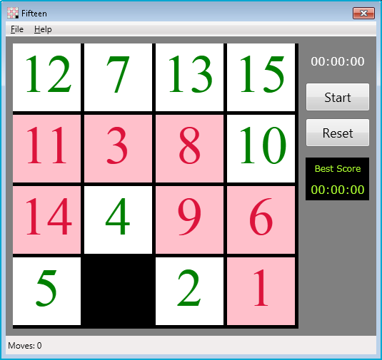
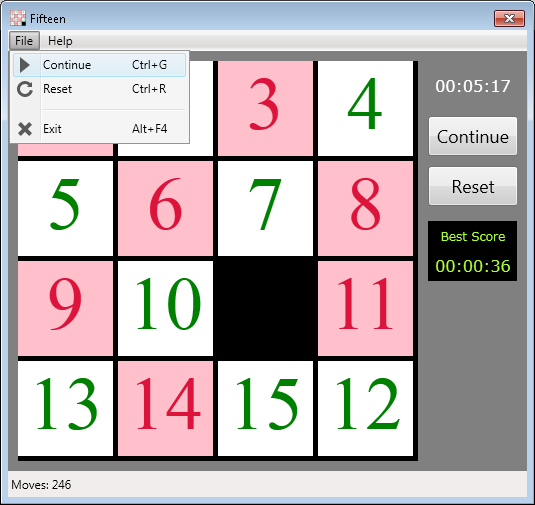
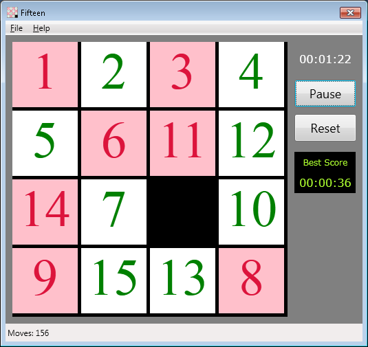
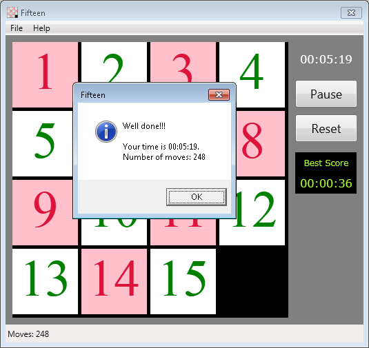

# Fifteen puzzle#

This is a classic 15-puzzle, one of the world’s most recognized and popular brainteasers.

### Details ###

The 15-puzzle (also called Gem Puzzle, Boss Puzzle, Game of Fifteen, Mystic Square and many
others) is a sliding puzzle that consists of a frame of numbered square tiles in random order
with one tile missing.

### The object ###

The object of the puzzle is to place the tiles in order by making sliding moves that use the 
empty space.

### How to run? ###

See the Release directory for the release version.

### How to play? ###

Attempt to slide scrambled tiles back in order from 1 to 15. 

### Screen shots ###

**Main application screen**

**File menu**

**In the process of the sliding**

**Final result**

### Author ###

Anahit Gardishyan [anahit.gardishyan@gmail.com](mailto:anahit.gardishyan@gmail.com)
